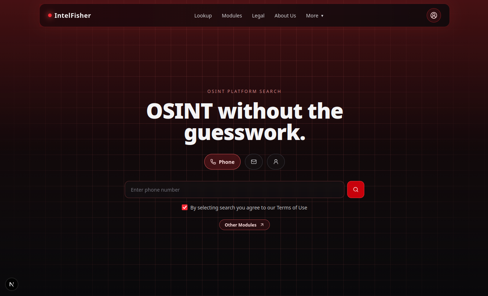

# 🔍 IntelFisher | OSINT without the guesswork.

The public facing repository for the IntelFisher project. A couple of years ago, I got an idea to create an all in one OSINT tool to discover information about people. I made a CLI tool that was both fast and efficient using `@click` from the Pallets project for easy usage. However, setting it up is pretty complex and time consuming, especially if you just want to run it once and then forget its existence. I recently got inspired to make this a website.

For now, this tool will be invite only. Invites are closed for now, unless you donate some money to the project. This is a complex project and running it at scale is expensive, as it will require a lot of preferably residential proxies. I am a broke student and I cannot afford to even test that. The plan is to release this under a cheap monthly subscription model to make this tool available for everyone.

This tool started as just a people OSINT tool. However, from my independent research, I was able to discover a lot more cool approaches to collect information about many other things. These have been listed under the "Other Modules" section. They will let you find information about things that are not just related to people. If these methods were released publicly, they might stop working. Therefore, I cannot make the backend open source even if I want to. These approaches shall remain trade secrets. The frontend is also not open source as of now, but I might make it open source soon.

The people OSINT part, however, is built not just to find basic information, but also to cross check results and verify them to ensure accuracy.

If you are a researcher and want access to this tool or the source, please reach me out at [`hello@hirusha.xyz`](mailto:hello@hirusha.xyz).
